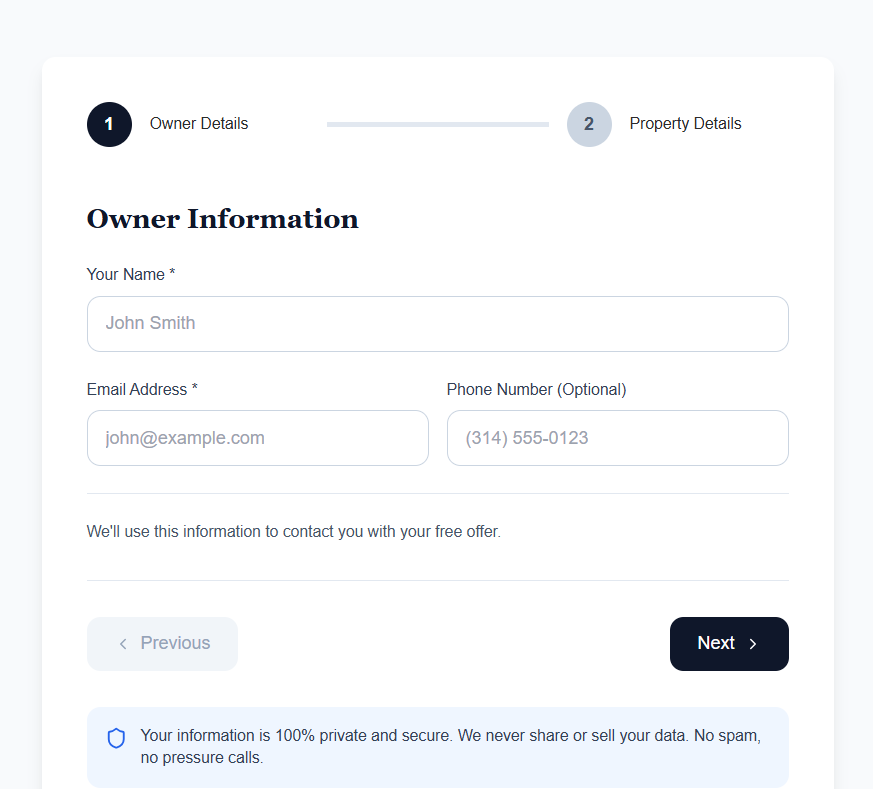

# Realty Trust Company Website


Marketing website for Realty Trust Company (St. Louis, MO) focused on a no-pressure, online-first cash offer process and situation-specific landing pages.

- Production: https://realtytrustco.com/



## Tech Stack

- Vite + React + TypeScript
- Tailwind CSS + shadcn/ui
- React Router

## Getting Started

Install dependencies:

```bash
npm ci
```

Run the dev server:

```bash
npm run dev
```

Build for production:

```bash
npm run build
```

Lint:

```bash
npm run lint
```

## Project Structure

- `index.html`: Base HTML template (includes sitewide JSON-LD for homepage)
- `src/pages`: Route pages (home, situations, supporting pages)
- `src/components`: Reusable UI + section components
- `public`: Static assets (logos, favicon, screenshots)

## SEO Notes

- Each route sets its own `document.title`, meta description, canonical URL, and JSON-LD on load.
- Situation pages are generated via `SituationPageTemplate` and support an optional CTA block directly below the hero.
